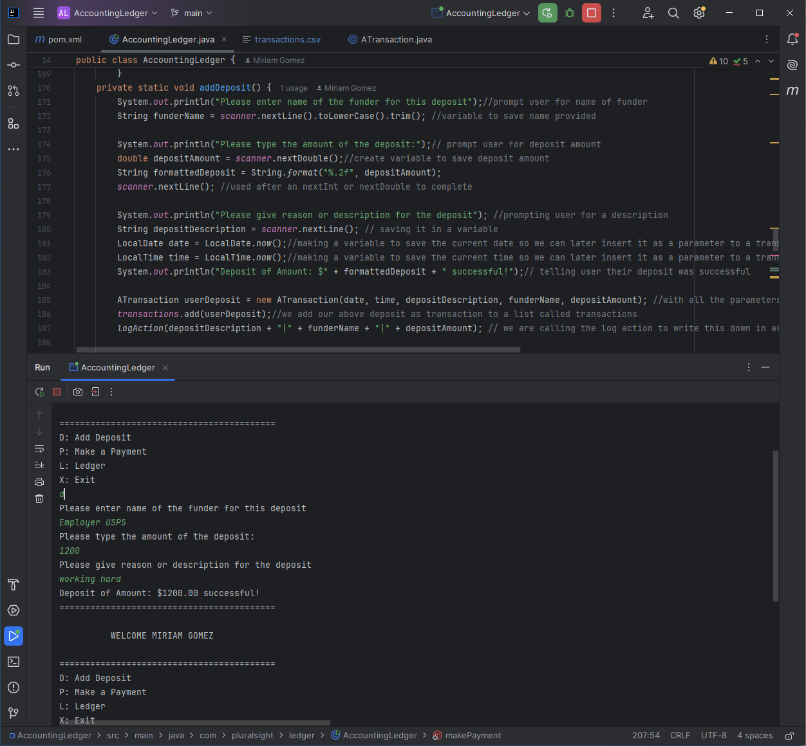
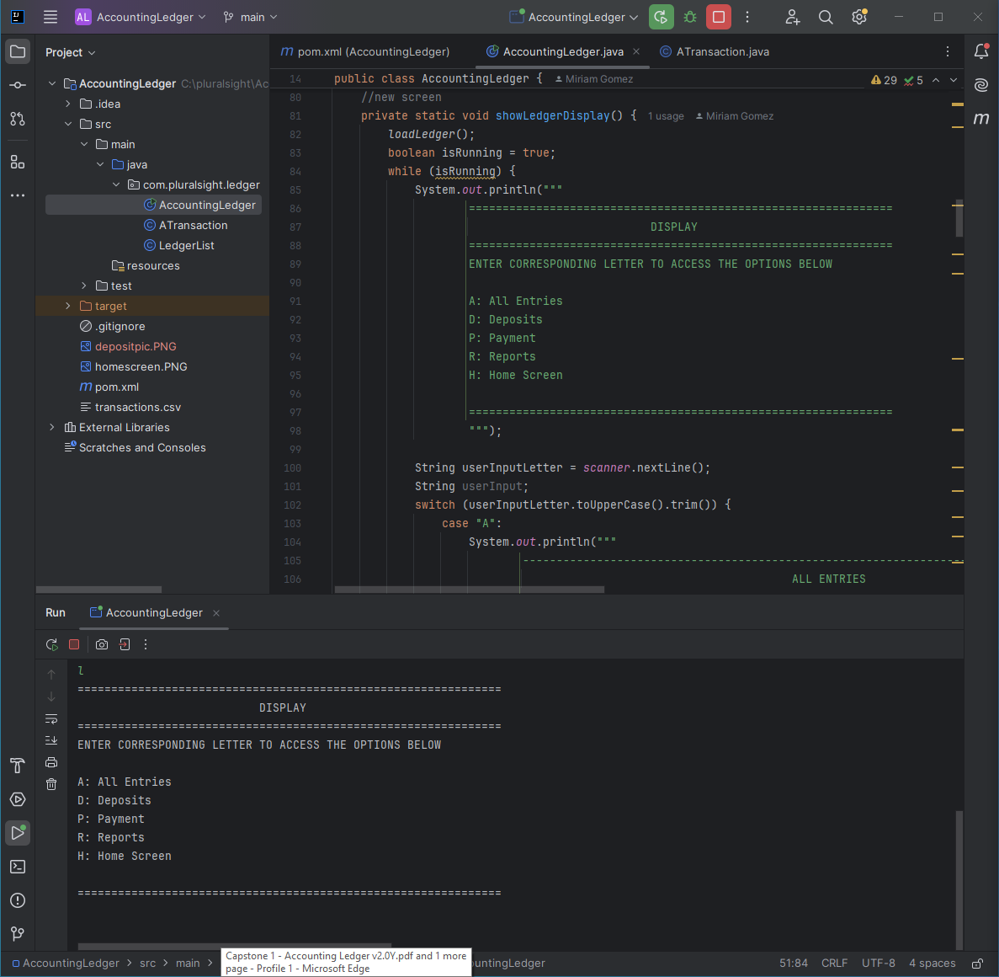
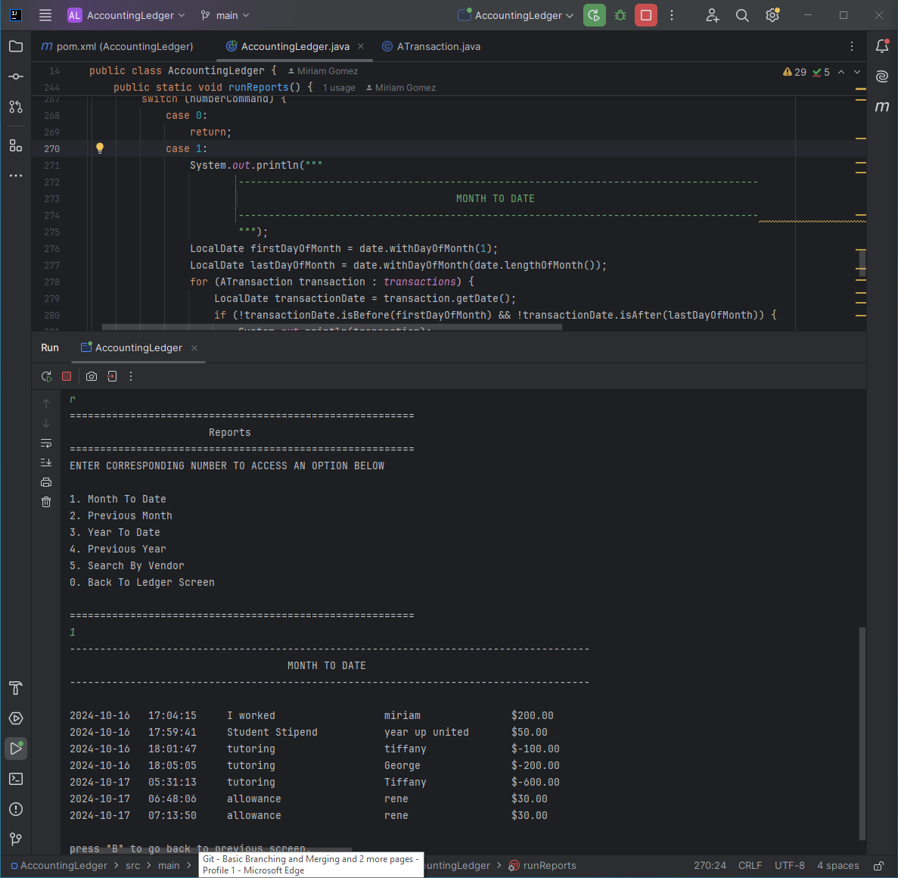

# Accounting Ledger Console App

### Overview
- I prompt you to enter your full name, so I can welcome you and run the application  
  

I just check that the users answer is not empty and that turns the boolean "isRunning" to true.
 
I added a method to add a deposit which prompts you for the funder name, deposit amount, and reason/description. Your run this method by entering the letter "d".
Inside the method I call the logAction to write to the csv file called transactions
I do the same with function "add a payment" but here I add another variable to which I call the -Math.abs(paymentAmount) so that it converts the given amount to negative.

For the Ledger screen I did the same as I did with the homescreen in the sense that I used a boolean to run the screen and switch method to run other functions. Here is where I call a method "loadLedger()" where I read the csv file called "transactions". From this I can get all entries to print, all deposits by only printing transactions with positive amount, or payments with negative amounts.

In the Run Reports screen to get the "Month To Date, Previous Month, Year To Date, and Previous Year I had to define the ranges so that if a transaction date fell in that range it could print out. 

To find the vendor I prompt you to enter the vendor name to which I check if the transaction vendor name is the same. If so I print them. 

Lastly to end the application you have to go back to ledger screen which gives the option to go back to "Homes Screen" and then enter "X" which then displays "Have a great day! Bye Bye now."
