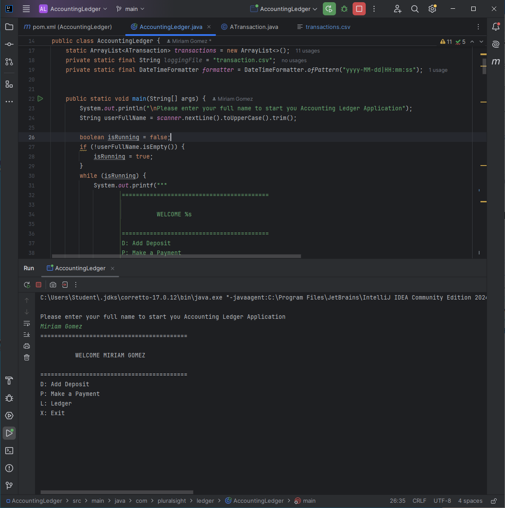

# Accounting Ledger Console App

### Overview
- I prompt you to enter your full name, so I can welcome you and run the application  
  

I just check that the users answer is not empty and that turns the boolean "isRunning" to true.
 
I added a method to add a deposit which prompts you for the funder name, deposit amount, and reason/description. Your run this method by entering the letter "d".
Inside the method I call the logAction to write to the csv file called transactions
I do the same with function "add a payment" but here I add another variable to which I call the -Math.abs(paymentAmount) so that it converts the given amount to negative.

For the Ledger screen I did the same as I did with the homescreen in the sense that I used a boolean to run the screen and switch method to run other functions.
